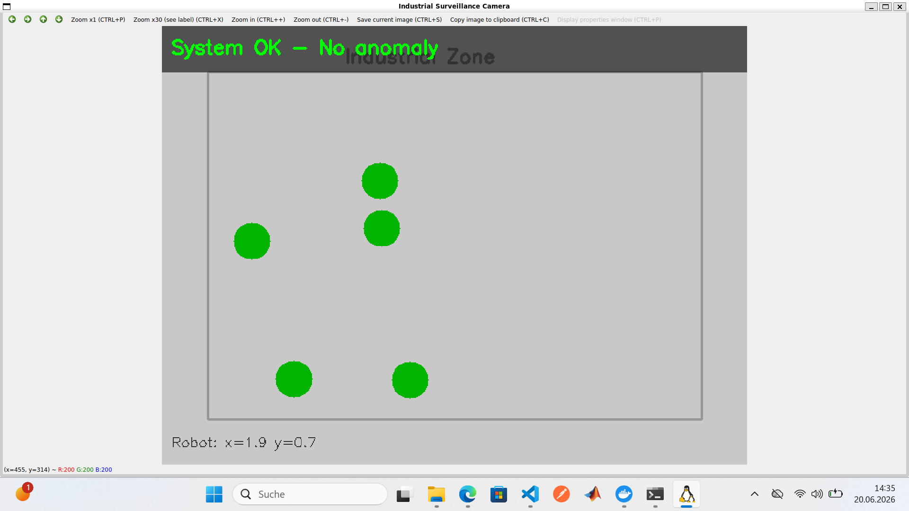
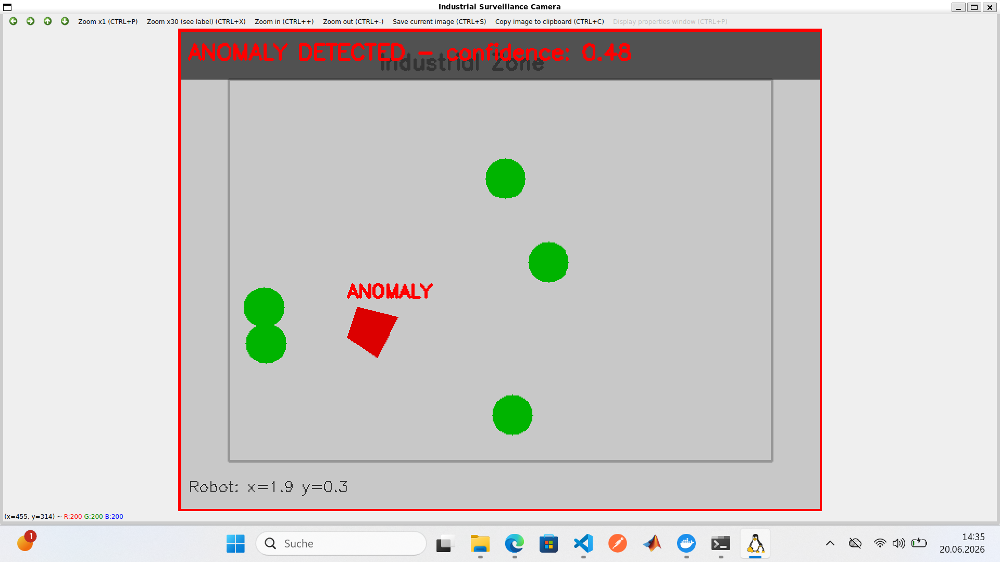
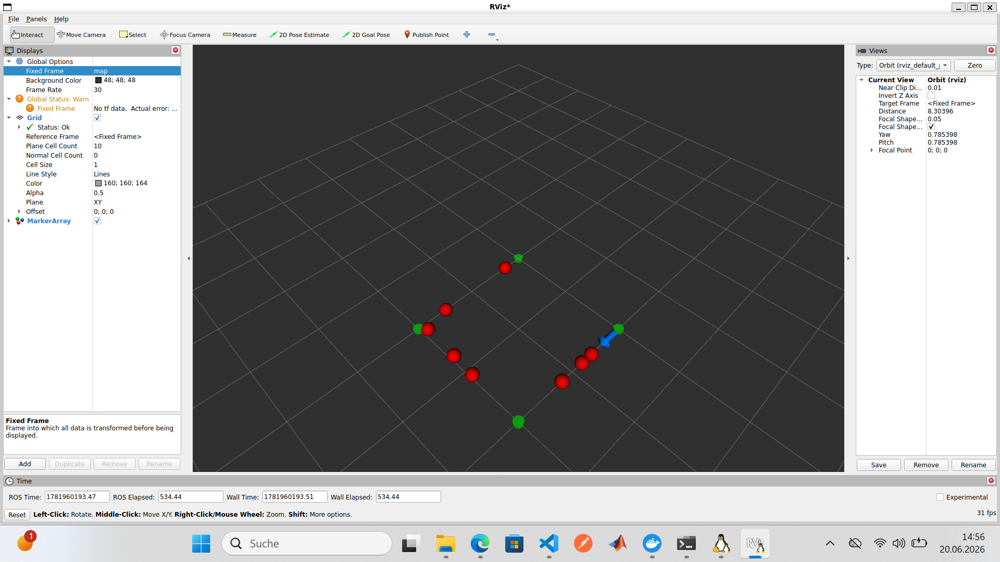
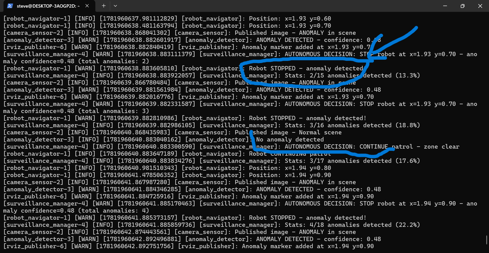

# ROS2 Surveillance Robot

Autonomous industrial surveillance robot built with ROS2 Jazzy — 5 nodes communicating via topics, OpenCV real-time anomaly detection, autonomous STOP/CONTINUE decisions and RViz2 visualization.


## ROS2 Topics

| Topic | Type | Description |
|-------|------|-------------|
| /robot/pose | Pose2D | Robot position (x, y, theta) |
| /camera/image_raw | Image | Simulated camera feed |
| /detection/result | String (JSON) | Anomaly detection result + confidence |
| /robot/command | String | STOP or CONTINUE command |
| /visualization/markers | MarkerArray | RViz2 markers |

## Screenshots

### OpenCV Camera View — Normal operation


### OpenCV Camera View — Anomaly detected


### RViz2 — Robot position, waypoints and anomaly markers


### Terminal — Autonomous decisions


## Quick start

```bash
# Install ROS2 Jazzy (Ubuntu 24.04)
sudo apt install ros-jazzy-desktop ros-jazzy-cv-bridge ros-jazzy-vision-opencv
sudo apt install ros-jazzy-visualization-msgs ros-jazzy-tf2-ros

# Build
source /opt/ros/jazzy/setup.bash
colcon build --packages-select surveillance_robot
source install/setup.bash

# Launch all nodes
ros2 launch surveillance_robot surveillance.launch.py

# Open RViz2 in a second terminal
rviz2
# Add MarkerArray topic: /visualization/markers
```

## Autonomous behavior

Camera publishes image every 1s (30% anomaly probability)

|

AnomalyDetector — OpenCV HSV red detection

|

SurveillanceManager decision:

confidence > 0.3 → publish STOP  → robot stops at current position

zone clear       → publish CONTINUE → robot resumes patrol

|

Visualizer — shows live camera with bounding boxes

RViz2      — shows robot path and anomaly positions in 3D space

## Bugs found and fixed during development

1. **Confidence threshold mismatch** — surveillance_manager threshold was 0.5 but detector reported 0.48, causing 0/N anomalies detected. Fixed by lowering threshold to 0.3.
2. **flake8 import order (I100/I201/Q000)** — ROS2 uses google-style import ordering. Fixed iteratively across 3 fix commits after CI detection.

## CI/CD

GitHub Actions on every push to main:
- ROS2 Jazzy environment setup
- colcon build
- colcon test (flake8 google-style, pep257, copyright)

## Author

Steve Meka
